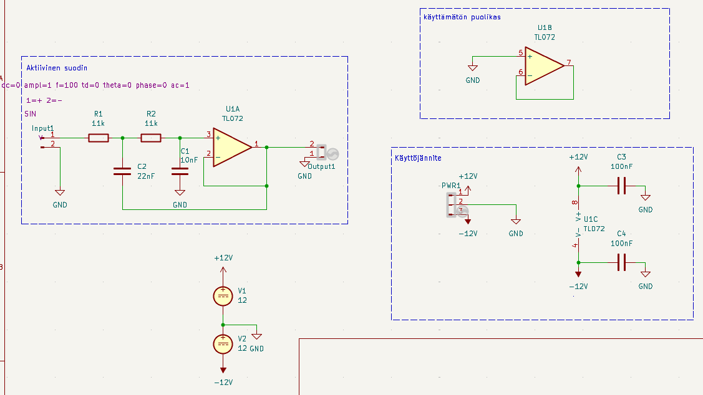
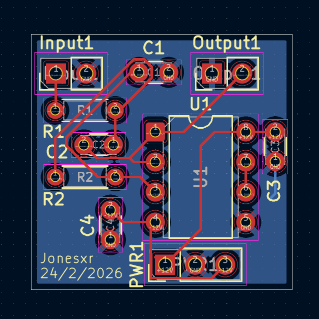
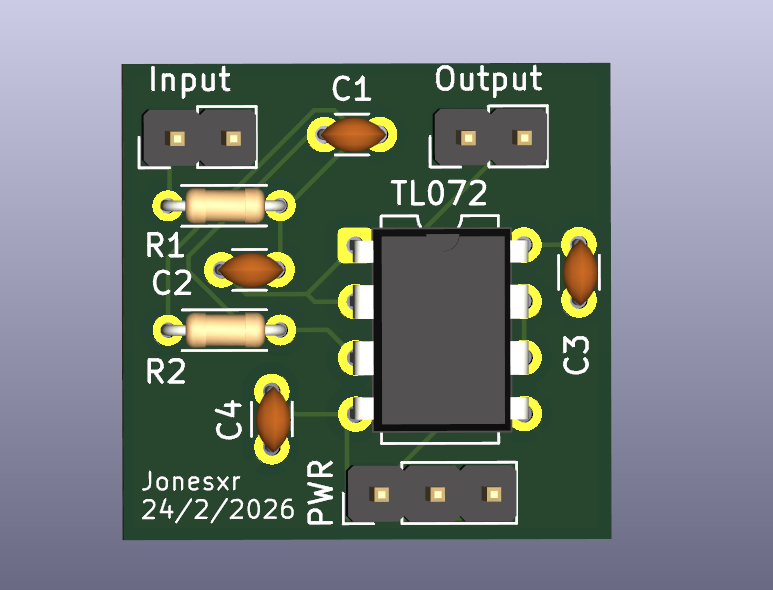
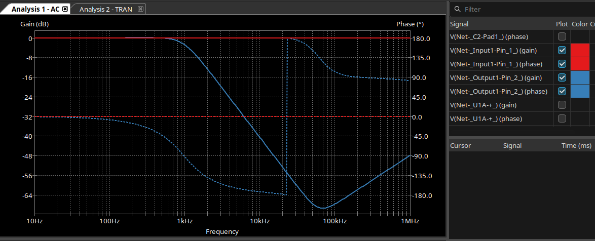
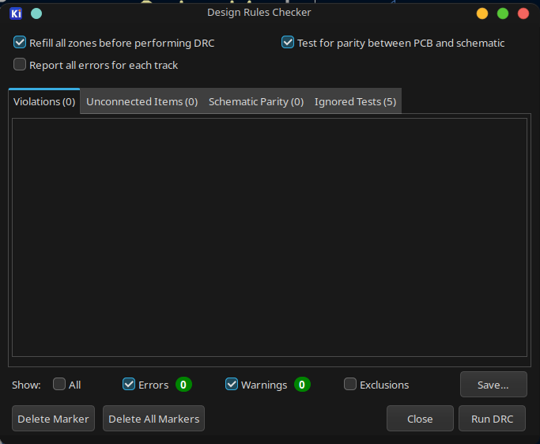

# Aktiivinen Sallen-Key Alipäästösuodatin

Projektissa toteutettiin 2. asteen aktiivisen Sallen-Key alipäästösuodin. Projekti sisältää sähkökaavion, piirilevyn layoutin sekä toimivan SPICE-simuloinnin ngspicellä.

## Sähkökaavio



_Suotimen sydän on TL072 dual JFET -operaatiovahvistin. Vastukset R1 ja R2 (11 kΩ) sekä kondensaattorit C1 (10 nF) ja C2 (22 nF) muodostavat varsinaisen suodatinpiirin. Käyttöjännite on ±12 V, ja ohituskondensaattorit C3 ja C4 (100 nF) pitävät käyttöjännitteen vakaana. Alakulmassa olevat jännitelähteet ovat simulaatiota varten._

## PCB-layout



_Piirilevy on suunniteltu kaksipuolisena. Komponentit on sijoiteltu etupuolelle ja takapuolella on yhtenäinen maataso (GND), joka auttaa häiriöiden torjunnassa._

## 3D-näkymä



_Tältä valmis levy näyttäisi. Kaikki komponentit ovat läpiladottavia (THT), eli levy on helppo juottaa käsin._

## Simulointitulokset



_AC-analyysin tulos ngspicestä. Punainen käyrä on tulosignaali ja sininen lähtösignaali. Rajataajuudella (~1 kHz) vaimennus on -3 dB, ja sen jälkeen signaali vaimenee jyrkästi -40 dB/dekadi. Katkoviivat näyttävät vaihevasteen._

## DRC-tarkistus



_Design Rule Check meni läpi puhtaasti – ei virheitä eikä varoituksia. Levy on valmis valmistettavaksi._

## Komponentit

| Komponentti | Arvo                     | Kotelo     |
| ----------- | ------------------------ | ---------- |
| U1          | TL072 (Dual JFET Op-Amp) | DIP-8      |
| R1, R2      | 11 kΩ                    | Axiaalinen |
| C1          | 10 nF                    | Levy       |
| C2          | 22 nF                    | Levy       |
| C3, C4      | 100 nF (ohitus)          | Levy       |

## Rajataajuus

```
f_c = 1 / (2π × √(R1×R2×C1×C2))
f_c = 1 / (2π × √(11k × 11k × 10n × 22n))
f_c ≈ 1.03 kHz
```

## Simuloinnin vianmääritys

Simuloinnin kanssa tuli vastaan useampi ongelma ennen kuin homma alkoi pelittää. Tässä dokumentoituna mitä meni pieleen ja miten asiat korjattiin – ehkä joku muu säästyy samoilta sudenkuopilta.

### 1. TL072:n SPICE-malli ei toiminut ngspicellä

ngspice antoi virheen:

```
Undefined parameter [i]
Expression err: 4.715e6*i(vb)-5e6*i(vc)+5e6*i(ve)+5e6*i(vlp)-5e6*i(vln)}
```

TI:n alkuperäinen malli käyttää `POLY`-syntaksia, jota ngspice ei ymmärrä. Ensin yritin `VALUE { }` -syntaksia, mutta sekään ei toiminut F-elementeillä (ngspice 44 ei tue sitä). Lopulta ratkaisu oli vaihtaa B-elementteihin:

```diff
- EGND 99  0 VALUE { 0.5*V(3) + 0.5*V(4) }
- FB    7 99 VALUE { 4.715E6*I(VB) - 5E6*I(VC) + 5E6*I(VE) + 5E6*I(VLP) - 5E6*I(VLN) }
+ BEGND 99  0 V = 0.5*V(3) + 0.5*V(4)
+ BFB   7 99 I = 4.715E6*I(VB) - 5E6*I(VC) + 5E6*I(VE) + 5E6*I(VLP) - 5E6*I(VLN)
```

### 2. Pinnit olivat väärin päin

Simulointi pyörähti käyntiin, mutta tulos näytti ylipäästösuotimelta – ei todellakaan se mitä haettiin. Syy oli yksinkertainen: TL072:n fyysiset DIP-8 pinnit oli mapattu väärin SPICE-mallin pinneihin.

```
TL072 DIP-8:
        ┌──U──┐
  OUT_A │1   8│ V+
   IN-_A│2   7│ OUT_B
   IN+_A│3   6│ IN-_B
     V- │4   5│ IN+_B
        └─────┘
```

SPICE-mallin pinnijärjestys on `1=Non-inv, 2=Inv, 3=V+, 4=V-, 5=Out`, joten oikea mappaus on:

```
Unit 1 (Op-Amp A): Sim.Pins = "3=1 2=2 8=3 4=4 1=5"
Unit 2 (Op-Amp B): Sim.Pins = "5=1 6=2 8=3 4=4 7=5"
```

### 3. Sim-kentissä oli tuplat

```
Error: Not enough tokens in line 16
u1 __u1
```

U1-symbolille oli jotenkin päätynyt kaksi sarjaa `Sim.*`-kenttiä – toisessa sarjassa kenttien nimissä oli ylimääräinen välilyönti perässä (esim. `"Sim.Device "` vs `"Sim.Device"`). Duplikaattien poisto korjasi ongelman.

### 4. Liittimet sotkivat simuloinnin

```
Error: Not enough tokens in line 21
output1 __output1
```

Input1- ja Output1-liittimet päätyivät SPICE-netlistiin vaikka niillä ei ole SPICE-mallia. Ratkaisu: `exclude_from_sim = yes` liittimille, ja tuloon oma VSIN-jännitelähde.

## Mitä tästä oppi

- **POLY ei toimi ngspicellä** – käytä B-elementtejä (`V =` ja `I =` syntaksi) sen sijaan
- **Dual op-ampin pinnimappaus** on tehtävä erikseen jokaiselle yksikölle vastaamaan fyysistä DIP-8 pinoutia
- **Fyysiset liittimet** pitää jättää simuloinnin ulkopuolelle (`exclude_from_sim = yes`)

## Tiedostorakenne

```
Aktiivinen_sallen_key_alipäästösuodin/
├── Aktiivinen_sallen_key_alipäästösuodin.kicad_sch   # Sähkökaavio
├── Aktiivinen_sallen_key_alipäästösuodin.kicad_pcb   # PCB-layout
├── Aktiivinen_sallen_key_alipäästösuodin.kicad_pro   # Projektitiedosto
├── simulation/
│   └── TL072.lib                                        # ngspice-yhteensopiva SPICE-malli
├── images/
│   ├── skema.png                                        # Sähkökaavio
│   ├── pcb.png                                          # PCB-layout
│   ├── 3d.png                                           # 3D-renderöinti
│   ├── taajuusvaste.png                                 # Taajuusvaste
│   └── DRC.png                                          # DRC-tulos
└── README.md                                            # Tämä tiedosto
```
